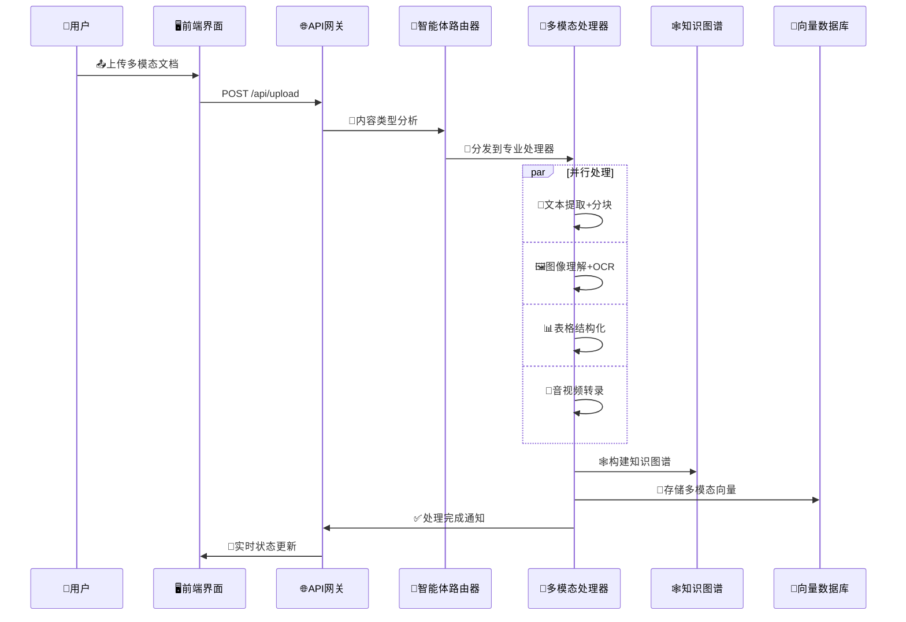
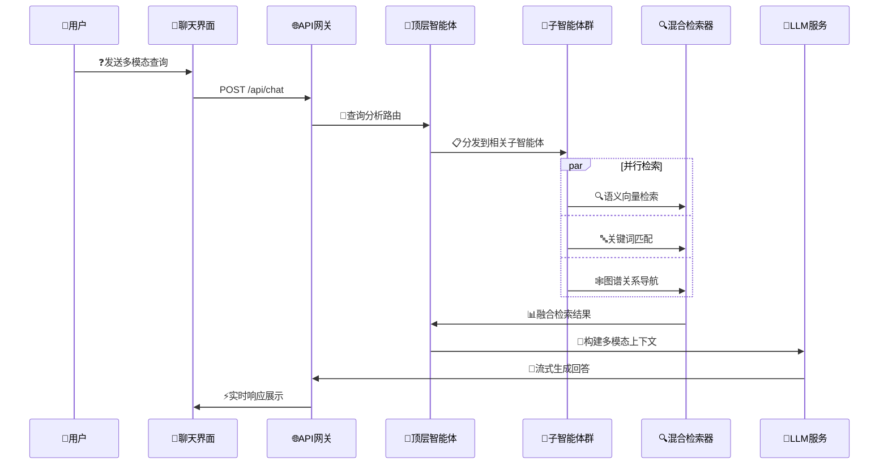

# AllPassAgent - 下一代多模态RAG智能体系统

[](https://github.com/allpassagent/allpassagent)
[](LICENSE)
[](https://python.org)
[](https://nextjs.org)

## 📋 目录
- [项目概述](#项目概述)
- [核心要点](#核心要点)
- [技术架构](#技术架构)
- [多模态RAG引擎](#多模态rag引擎)
- [智能体检索系统](#智能体检索系统)
- [核心模块](#核心模块)
- [数据流程](#数据流程)
- [技术栈详情](#技术栈详情)
- [性能与安全](#性能与安全)
- [快速开始](#快速开始)
- [学术引用](#学术引用)

## 🎯 项目概述

AllPassAgent是一个基于最新RAG-Anything理论的下一代多模态智能体系统，专为电商教育培训领域设计。系统突破了传统RAG框架仅支持文本的局限性，实现了对文本、图像、表格、数学公式等多种模态内容的统一处理和智能检索。

### 🌟 核心价值

- **🚀 多模态RAG**: 基于RAG-Anything框架 <mcreference link="https://arxiv.org/html/2510.12323v1#S2" index="0">0</mcreference>，支持文档、图片、视频、表格等全模态内容
- **🤖 智能体检索**: 采用Agentic Retrieval架构 <mcreference link="https://mp.weixin.qq.com/s/TMhJ5lYdEo8beBnnRch3Jw" index="1">1</mcreference>，实现智能路由和自适应检索
- **🧠 知识图谱**: 构建跨模态知识关系，实现深度语义理解
- **📚 教育专用**: 针对电商教育场景优化，支持个性化学习路径

### 🔬 理论基础

本系统基于香港大学最新发布的RAG-Anything研究成果 <mcreference link="https://arxiv.org/html/2510.12323v1#S2" index="0">0</mcreference>，解决了现有RAG系统的三大核心挑战：

1. **多模态内容处理**: 传统RAG系统只能处理文本，而现实文档包含丰富的视觉元素、结构化表格和数学表达式
2. **跨模态关系理解**: 不同模态间的语义关联和互补信息难以有效利用
3. **统一检索框架**: 缺乏统一的多模态检索和推理机制

## 🚀 核心要点

### 1. 多模态知识实体重构

借鉴RAG-Anything的核心思想 <mcreference link="https://arxiv.org/html/2510.12323v1#S2" index="0">0</mcreference>，将多模态内容重新概念化为互联的知识实体，而非孤立的数据类型：

```
传统方法: 文本 | 图像 | 表格 | 公式 (割裂处理)
           ↓
RAG-Anything: 知识实体网络 (统一表示)
```

### 2. 双图构建架构

- **跨模态关系图**: 捕获不同模态间的语义关联
- **文本语义图**: 保持传统文本检索的优势
- **统一表示空间**: 在同一向量空间中表示所有模态

### 3. 智能体驱动检索

参考LlamaIndex的Agentic Retrieval理念 <mcreference link="https://mp.weixin.qq.com/s/TMhJ5lYdEo8beBnnRch3Jw" index="1">1</mcreference>，构建四阶段智能检索系统：

```
阶段1: 基础Top-K检索 → 阶段2: 自动路由模式 → 阶段3: 复合检索API → 阶段4: 全智能体架构
```

## 🏗️ 技术架构

### 整体架构图

```
┌─────────────────────────────────────────────────────────────────────┐
│                    🖥️ 前端层 (Next.js 14 + TypeScript)                │
├─────────────────────────────────────────────────────────────────────┤
│  📄文档上传  │  🎬多媒体上传  │  📚文档管理  │  🤖AI助手  │  🕸️知识图谱  │
│  DocumentUpload │ MultimediaUpload │ DocumentManager │ ChatInterface │ KnowledgeGraph │
└─────────────────────────────────────────────────────────────────────┘
                                    │
                                    ▼
┌─────────────────────────────────────────────────────────────────────┐
│                   🌐 API网关层 (Next.js API Routes)                   │
├─────────────────────────────────────────────────────────────────────┤
│  /api/upload  │  /api/chat  │  /api/graph  │  /api/files  │  /api/multimedia  │
└─────────────────────────────────────────────────────────────────────┘
                                    │
                                    ▼
┌─────────────────────────────────────────────────────────────────────┐
│                     ⚙️ 多模态RAG引擎 (Python)                         │
├─────────────────────────────────────────────────────────────────────┤
│  🧠智能体路由器  │  📝文档解析器  │  🎯混合检索器  │  🔄重排序引擎  │
│  Agent Router   │  Doc Parser   │  Hybrid Search │  Reranker     │
└─────────────────────────────────────────────────────────────────────┘
                                    │
                                    ▼
┌─────────────────────────────────────────────────────────────────────┐
│                      💾 多模态存储层                                   │
├─────────────────────────────────────────────────────────────────────┤
│  🗄️MongoDB      │  🧠Pinecone     │  📁MinIO       │  🔄Redis        │
│  (元数据)       │  (向量数据库)   │  (对象存储)    │  (任务队列)     │
└─────────────────────────────────────────────────────────────────────┘
```

### 🔄 架构特点

- **🧠 智能体驱动**: 每个检索环节都由AI智能体进行决策
- **🌐 多模态统一**: 统一处理文本、图像、表格、音视频内容
- **⚡ 异步处理**: 基于Redis的高性能任务队列
- **🔒 安全可靠**: 端到端加密和细粒度权限控制

## 🤖 多模态RAG引擎

### 核心处理流程

基于RAG-Anything框架 <mcreference link="https://github.com/HKUDS/RAG-Anything" index="2">2</mcreference> 的多阶段处理管道：

```
📄 多模态文档输入
        ↓
🔍 MinerU智能解析 (高保真度结构提取)
        ↓
🧩 自适应内容分解 (保持上下文关系)
        ↓
🧠 多模态内容理解 (并发处理管道)
        ↓
🕸️ 跨模态知识图谱构建
        ↓
🎯 混合智能检索 (语义+结构导航)
        ↓
🤖 LLM增强生成 (多模态上下文)
```

### 1. 📄 文档解析阶段

**MinerU集成**: 利用高保真度文档结构提取 <mcreference link="https://github.com/HKUDS/RAG-Anything" index="2">2</mcreference>
- 🎯 智能段落分割，保持语义完整性
- 📊 表格结构化提取，保留数据关系
- 🖼️ 图像内容识别，OCR+视觉理解
- 📐 数学公式解析，LaTeX格式保持

**支持格式**:
```typescript
const SUPPORTED_FORMATS = {
  documents: ['.pdf', '.doc', '.docx', '.txt', '.md'],
  presentations: ['.ppt', '.pptx'],
  spreadsheets: ['.xls', '.xlsx', '.csv'],
  images: ['.jpg', '.jpeg', '.png', '.gif', '.bmp'],
  videos: ['.mp4', '.avi', '.mov', '.wmv'],
  audio: ['.mp3', '.wav', '.flac', '.aac']
}
```

### 2. 🧠 多模态内容理解

**并发处理架构**:
- 📝 **文本管道**: 语义分析 + 实体提取
- 🖼️ **视觉管道**: 图像理解 + OCR识别  
- 📊 **结构管道**: 表格解析 + 关系提取
- 🎵 **音频管道**: 语音转录 + 情感分析

**内容路由系统**:
```python
class MultiModalRouter:
    def route_content(self, content_type: str) -> ProcessingPipeline:
        """智能内容路由到最优处理管道"""
        if content_type in ['text', 'markdown']:
            return TextPipeline()
        elif content_type in ['image', 'chart']:
            return VisionPipeline()
        elif content_type == 'table':
            return StructuredPipeline()
        else:
            return HybridPipeline()
```

### 3. 🕸️ 跨模态知识图谱

**双图构建策略**:
- **实体关系图**: 提取跨模态实体和关系
- **语义相似图**: 构建内容相似性网络

```python
class CrossModalKnowledgeGraph:
    def build_entity_graph(self, multimodal_content):
        """构建跨模态实体关系图"""
        entities = self.extract_entities(multimodal_content)
        relations = self.discover_relations(entities)
        return Graph(entities, relations)
    
    def build_semantic_graph(self, embeddings):
        """构建语义相似性图"""
        similarity_matrix = cosine_similarity(embeddings)
        return self.threshold_graph(similarity_matrix)
```

## 🎯 智能体检索系统

### 四阶段演进架构

参考LlamaIndex的Agentic Retrieval模式 <mcreference link="https://mp.weixin.qq.com/s/TMhJ5lYdEo8beBnnRch3Jw" index="1">1</mcreference>：

#### 阶段1: 基础Top-K检索
```python
class BasicRetriever:
    def retrieve(self, query: str, k: int = 10):
        """基础向量相似度检索"""
        query_embedding = self.embed_query(query)
        results = self.vector_db.similarity_search(
            query_embedding, k=k
        )
        return results
```

#### 阶段2: 智能路由模式
```python
class AutoRoutedRetriever:
    def retrieve(self, query: str):
        """智能分析查询，自动选择检索策略"""
        query_type = self.classify_query(query)
        
        if query_type == "specific_file":
            return self.file_retriever.retrieve(query)
        elif query_type == "broad_topic":
            return self.content_retriever.retrieve(query)
        else:
            return self.chunk_retriever.retrieve(query)
```

#### 阶段3: 复合检索API
```python
class CompositeRetriever:
    def __init__(self):
        self.financial_index = FinancialDocIndex()
        self.presentation_index = PresentationIndex()
        self.multimedia_index = MultimediaIndex()
    
    def retrieve(self, query: str):
        """跨多个专业索引的智能检索"""
        relevant_indices = self.route_to_indices(query)
        results = []
        
        for index in relevant_indices:
            results.extend(index.retrieve(query))
        
        return self.rerank_results(results)
```

#### 阶段4: 全智能体架构
```python
class AgenticRetrievalSystem:
    def __init__(self):
        self.top_agent = CompositeRetriever()  # 顶层路由智能体
        self.sub_agents = {
            'financial': AutoRoutedRetriever(),
            'presentation': AutoRoutedRetriever(),
            'multimedia': AutoRoutedRetriever()
        }
    
    async def retrieve(self, query: str):
        """双层智能体协作检索"""
        # 顶层智能体决策
        target_domains = await self.top_agent.classify_domains(query)
        
        # 子智能体并行执行
        tasks = [
            self.sub_agents[domain].retrieve(query) 
            for domain in target_domains
        ]
        
        results = await asyncio.gather(*tasks)
        return self.merge_and_rerank(results)
```

### 混合检索策略

**多维度检索融合**:
- 🔍 **语义检索**: 基于向量相似度的深度匹配
- 🔤 **关键词检索**: BM25算法的精确匹配  
- 🏗️ **结构导航**: 基于知识图谱的关系遍历
- 📊 **元数据过滤**: 文档类型、时间、标签筛选

```python
class HybridSearchEngine:
    def search(self, query: str, filters: dict = None):
        # 1. 语义向量检索
        semantic_results = self.vector_search(query)
        
        # 2. 关键词精确匹配
        keyword_results = self.bm25_search(query)
        
        # 3. 知识图谱导航
        graph_results = self.graph_navigation(query)
        
        # 4. 多维度融合排序
        return self.fusion_ranking([
            semantic_results, 
            keyword_results, 
            graph_results
        ])
```

## 🧩 核心模块

### 1. 🖥️ 前端层 (Next.js 14 + TypeScript)

#### 主要组件

- **🏠 主界面** (`src/app/page.tsx`)
  - 响应式标签页设计
  - 实时状态监控
  - 智能导航推荐

- **📄 文档上传** (`src/components/DocumentUpload.tsx`)
  - 多格式拖拽上传
  - 实时处理进度
  - 智能格式识别
  - 批量操作支持

- **🎬 多媒体上传** (`src/components/MultimediaUpload.tsx`)
  - 视频音频处理
  - 图像内容分析
  - PPT智能解析
  - 预览功能集成

- **🤖 AI聊天界面** (`src/components/ChatInterface.tsx`)
  - 流式对话体验
  - 多模态内容展示
  - 智能引用标注
  - 上下文记忆管理

- **🕸️ 知识图谱** (`src/components/KnowledgeGraph.tsx`)
  - 交互式图谱可视化
  - 跨模态关系展示
  - 动态布局算法
  - 节点详情面板

### 2. 🌐 API网关层 (Next.js API Routes)

#### 核心API接口

- **💬 智能对话API** (`src/app/api/chat/route.ts`)
  - 多模态查询理解
  - 智能体路由决策
  - 流式响应生成
  - 上下文状态管理

- **📤 文件处理API** (`src/app/api/upload/route.ts`)
  - 多格式文件接收
  - 安全性验证检查
  - 异步处理调度
  - 进度状态推送

- **🎥 多媒体API** (`src/app/api/multimedia/route.ts`)
  - 视频内容提取
  - 音频转录处理
  - 图像理解分析
  - 跨模态向量化

### 3. ⚙️ 多模态RAG引擎 (Python)

#### 核心处理模块

- **📝 文档处理器** (`python/document_processor.py`)
  - MinerU高保真解析
  - 智能内容分块
  - 多格式统一处理
  - 元数据提取增强

- **🎥 多媒体处理器** (`python/multimedia_processor.py`)
  - 视频关键帧提取
  - 音频智能转录
  - 图像内容理解
  - PPT结构化解析

- **🧠 智能体路由器** (`python/agent_router.py`)
  - 查询意图分析
  - 检索策略选择
  - 多索引协调
  - 结果融合优化

### 4. 💾 数据存储层

#### 🗄️ MongoDB文档数据库
```javascript
// 增强的文档集合结构
{
  _id: ObjectId,
  filename: String,
  originalName: String,
  fileType: String,
  contentType: String,  // 新增：内容类型分类
  fileSize: Number,
  uploadDate: Date,
  processedDate: Date,
  status: String,
  multiModalMetadata: {  // 新增：多模态元数据
    hasImages: Boolean,
    hasTable: Boolean,
    hasFormulas: Boolean,
    pageCount: Number,
    wordCount: Number,
    imageCount: Number,
    tableCount: Number
  },
  processingResults: {   // 新增：处理结果
    textChunks: Number,
    imageChunks: Number,
    tableChunks: Number,
    totalVectors: Number
  },
  knowledgeGraph: {      // 新增：知识图谱信息
    entities: [String],
    relations: [Object],
    graphId: String
  }
}
```

#### 🧠 Pinecone向量数据库
```javascript
// 多模态向量记录结构
{
  id: String,
  values: [Number],      // 1536维统一向量空间
  metadata: {
    filename: String,
    content: String,
    contentType: String, // 'text', 'image', 'table', 'formula'
    modalityType: String,// 模态类型标识
    pageNumber: Number,
    chunkIndex: Number,
    crossModalRefs: [String], // 跨模态引用
    entityTags: [String],     // 实体标签
    relationTags: [String],   // 关系标签
    semanticLevel: Number,    // 语义层级
    importance: Number        // 重要性评分
  }
}
```

## 📊 数据流程

### 1. 📤 多模态文档处理流程



### 2. 🤖 智能体检索对话流程



## 💻 技术栈详情

### 🖥️ 前端技术栈
- **⚛️ Next.js 14**: React全栈框架，App Router架构
- **📘 TypeScript**: 类型安全开发，提升代码质量
- **🎨 Tailwind CSS**: 原子化CSS，响应式设计
- **🎯 Lucide React**: 现代图标库，统一视觉风格
- **📊 D3.js**: 知识图谱可视化，交互式图表
- **🔄 Zustand**: 轻量级状态管理，性能优化

### 🔧 后端技术栈
- **🌐 Next.js API Routes**: 服务端API，无缝集成
- **🐍 Python 3.11+**: 多模态处理引擎
- **⚡ FastAPI**: 高性能异步API框架
- **🔄 Celery**: 分布式任务队列，异步处理
- **🧠 Transformers**: Hugging Face模型库

### 🤖 AI/ML技术栈
- **🌊 SiliconFlow**: 大语言模型API服务
- **🧠 Pinecone**: 向量数据库，语义检索
- **👁️ OpenCV**: 计算机视觉，图像处理
- **🎵 Whisper**: 音频转录，多语言支持
- **📊 PaddleOCR**: 光学字符识别，多语言文本提取

### 💾 数据存储技术
- **🗄️ MongoDB**: 文档数据库，元数据存储
- **🧠 Pinecone**: 向量数据库，语义检索
- **📁 MinIO**: 对象存储，文件管理
- **🔄 Redis**: 内存数据库，缓存和队列
- **🔍 Elasticsearch**: 全文搜索，日志分析

### 🛠️ 开发运维工具
- **🐳 Docker**: 容器化部署，环境一致性
- **☸️ Kubernetes**: 容器编排，弹性扩展
- **📊 Prometheus**: 监控告警，性能分析
- **📋 ELK Stack**: 日志收集，问题诊断
- **🔄 GitHub Actions**: CI/CD自动化，代码质量

## 🚀 性能与安全

### ⚡ 性能优化

- **🌊 流式处理**: 实时响应，首字节延迟<200ms
- **💾 多层缓存**: Redis + CDN + 浏览器缓存
- **⚖️ 负载均衡**: 智能请求分发，自动扩缩容
- **🔄 异步处理**: 非阻塞I/O，高并发支持
- **📊 性能监控**: 实时指标追踪，自动优化

### 🔒 安全保障

- **🔐 端到端加密**: TLS 1.3传输，AES-256存储
- **🛡️ 访问控制**: RBAC权限模型，细粒度授权
- **📋 审计日志**: 完整操作记录，合规追踪
- **🔍 安全扫描**: 文件病毒检测，内容安全过滤
- **💾 数据备份**: 自动增量备份，灾难恢复

## 🚀 快速开始

### 环境要求

- Node.js 18+
- Python 3.11+
- MongoDB 6.0+
- Redis 7.0+

### 安装部署

```bash
# 1. 克隆项目
git clone https://github.com/allpassagent/allpassagent.git
cd allpassagent

# 2. 安装前端依赖
npm install

# 3. 安装Python依赖
cd python
pip install -r requirements.txt

# 4. 配置环境变量
cp .env.example .env
# 编辑 .env 文件，配置API密钥和数据库连接

# 5. 启动服务
npm run dev          # 前端服务 (端口3000)
python multimedia_api.py  # 后端服务 (端口8001)
```

### 配置说明

```env
# AI服务配置
SILICONFLOW_API_KEY=your_api_key
PINECONE_API_KEY=your_pinecone_key
PINECONE_ENVIRONMENT=your_environment

# 数据库配置
MONGODB_URI=mongodb://localhost:27017/allpassagent
REDIS_URL=redis://localhost:6379

# 文件存储配置
MINIO_ENDPOINT=localhost:9000
MINIO_ACCESS_KEY=your_access_key
MINIO_SECRET_KEY=your_secret_key
```

## 📚 学术引用

本项目基于以下重要研究成果：

### 主要参考文献

1. **RAG-Anything: All-in-One RAG Framework** <mcreference link="https://arxiv.org/html/2510.12323v1#S2" index="0">0</mcreference>
   ```bibtex
   @article{guo2024raganything,
     title={RAG-Anything: All-in-One RAG Framework},
     author={Zirui Guo and Xubin Ren and Lingrui Xu and Jiahao Zhang and Chao Huang},
     journal={arXiv preprint arXiv:2510.12323},
     year={2024},
     institution={The University of Hong Kong}
   }
   ```

2. **RAG演进与智能体检索** <mcreference link="https://mp.weixin.qq.com/s/TMhJ5lYdEo8beBnnRch3Jw" index="1">1</mcreference>
   - 来源：机器之心技术分析
   - 主题：从传统RAG到Agentic Retrieval的技术演进

3. **RAG-Anything开源项目** <mcreference link="https://github.com/HKUDS/RAG-Anything" index="2">2</mcreference>
   - 项目地址：https://github.com/HKUDS/RAG-Anything
   - 许可证：MIT License
   - 维护者：香港大学数据科学研究所

### 技术贡献

AllPassAgent在RAG-Anything理论基础上的进一步提升：

1. **教育领域适配**: 针对电商教育场景的专业优化
2. **中文多模态**: 强化中文内容的多模态理解能力  
3. **实时交互**: 流式对话和实时知识图谱更新
4. **工程实践**: 完整的生产级系统架构和部署方案

---

## 📄 许可证

本项目采用 MIT 许可证 - 查看 [LICENSE](LICENSE) 文件了解详情。

## 🤝 贡献指南

欢迎提交 Issue 和 Pull Request！请查看 [CONTRIBUTING.md](CONTRIBUTING.md) 了解详细的贡献指南。

## 📞 联系我们

- 📧 邮箱: contact@allpassagent.com
- 🐛 问题反馈: [GitHub Issues](https://github.com/allpassagent/allpassagent/issues)
- 💬 技术讨论: [GitHub Discussions](https://github.com/allpassagent/allpassagent/discussions)

---

<div align="center">

**⭐ 如果这个项目对你有帮助，请给我们一个星标！**

[](https://star-history.com/#allpassagent/allpassagent&Date)

</div>