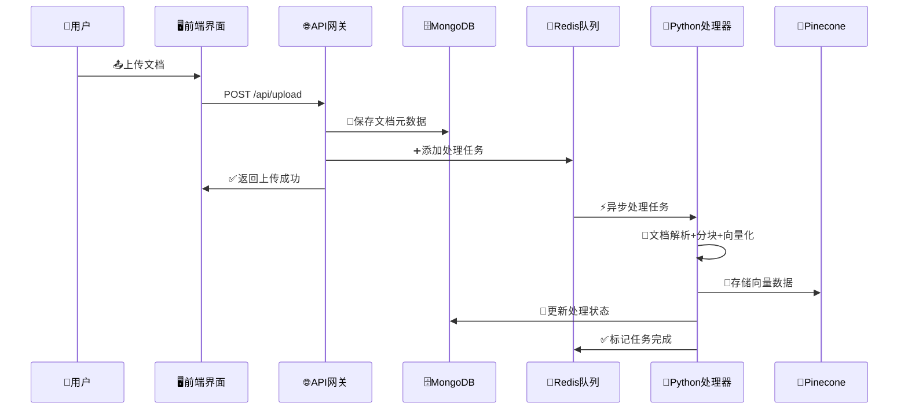
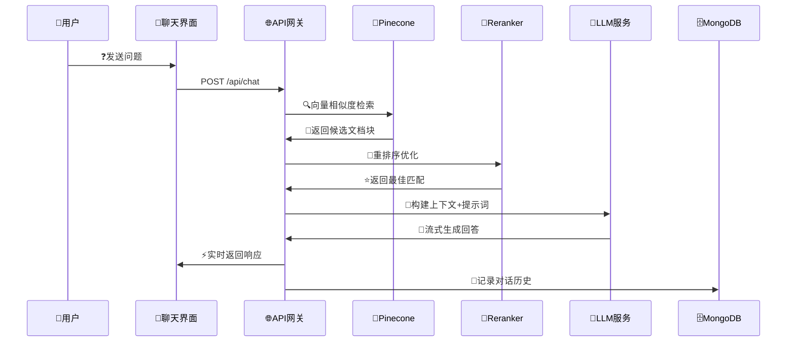
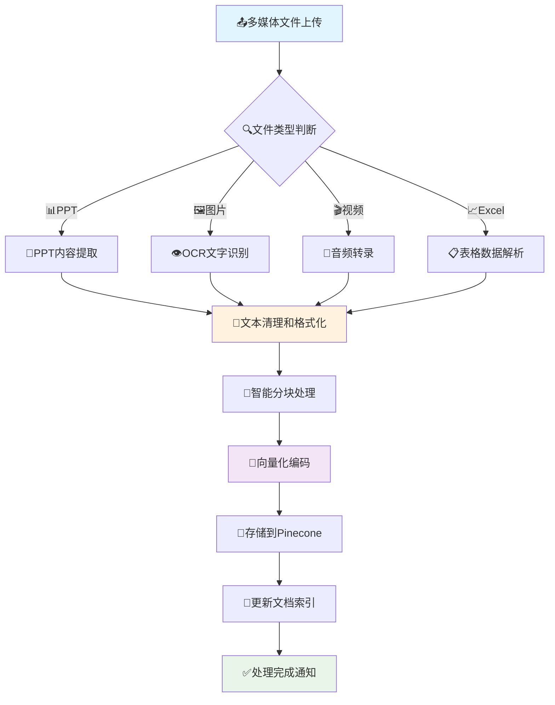

# 电商教育培训智能体 - 系统架构文档

## 📋 目录
- [项目概述](#项目概述)
- [智能文档处理核心流程](#智能文档处理核心流程)
- [技术架构](#技术架构)
- [核心模块](#核心模块)
- [数据流程](#数据流程)
- [核心特性](#核心特性)
- [技术栈详情](#技术栈详情)
- [性能与安全](#性能与安全)
- [扩展性设计](#扩展性设计)
- [监控和日志](#监控和日志)

## 🎯 项目概述

电商教育培训智能体是一个基于AI驱动的智能培训教育系统，专门针对电子商务教学领域。系统集成了文档处理、多媒体分析、智能问答、知识图谱等功能，为电商教育提供全方位的智能化支持。

### 🌟 核心价值
- **智能化教学**: 基于RAG技术的精准问答系统
- **多模态支持**: 支持文档、图片、视频等多种内容格式
- **个性化学习**: 根据用户反馈持续优化学习体验
- **知识图谱**: 可视化知识关系，构建完整知识体系

## 🏗️ 技术架构

### 整体架构图

```
┌─────────────────────────────────────────────────────────────┐
│                    🖥️ 前端层 (Next.js)                      │
├─────────────────────────────────────────────────────────────┤
│  📄文档上传  │  🎬多媒体上传  │  📚文档管理  │  🤖AI助手  │  🕸️知识图谱  │
│  DocumentUpload │ MultimediaUpload │ DocumentManager │ ChatInterface │ KnowledgeGraph │
└─────────────────────────────────────────────────────────────┘
                                │
                                ▼
┌─────────────────────────────────────────────────────────────┐
│                   🌐 API网关层 (Next.js API)                 │
├─────────────────────────────────────────────────────────────┤
│  /api/upload  │  /api/chat  │  /api/graph  │  /api/files  │  /api/multimedia  │
└─────────────────────────────────────────────────────────────┘
                                │
                                ▼
┌─────────────────────────────────────────────────────────────┐
│                     ⚙️ 业务逻辑层                              │
├─────────────────────────────────────────────────────────────┤
│  📝文档处理服务  │  💬AI对话服务  │  🔍向量检索服务  │  🎥多媒体处理服务  │
│  (Python)     │  (SiliconFlow) │  (Pinecone)   │  (Python)      │
└─────────────────────────────────────────────────────────────┘
                                │
                                ▼
┌─────────────────────────────────────────────────────────────┐
│                      💾 数据存储层                            │
├─────────────────────────────────────────────────────────────┤
│    🗄️MongoDB     │    🧠Pinecone    │    📁本地文件系统    │    🔄Redis队列    │
│   (文档元数据)   │   (向量数据库)   │   (文件存储)      │   (任务队列)    │
└─────────────────────────────────────────────────────────────┘
```

### 🔄 架构特点
- **微服务架构**: 模块化设计，便于扩展和维护
- **异步处理**: 队列机制确保高并发处理能力
- **多层缓存**: 提升系统响应速度和用户体验
- **容错设计**: 完善的错误处理和恢复机制

## 🧩 核心模块

### 1. 🖥️ 前端层 (Next.js + React + TypeScript)

#### 主要组件
- **🏠 主页面** (`src/app/page.tsx`)
  - 统一的导航界面
  - 标签页切换管理
  - 响应式布局设计

- **📄 文档上传** (`src/components/DocumentUpload.tsx`)
  - 支持多种文档格式 (PDF, DOC, TXT等)
  - 拖拽上传功能
  - 上传进度显示
  - 实时状态反馈

- **🎬 多媒体上传** (`src/components/MultimediaUpload.tsx`)
  - 支持PPT、图片、视频等格式
  - 多媒体内容预处理
  - 批量上传管理
  - 预览功能

- **🤖 AI聊天界面** (`src/components/ChatInterface.tsx`)
  - 流式对话显示
  - 参考文档展示
  - 文件链接功能
  - 智能推荐显示
  - 多轮对话上下文

- **🕸️ 知识图谱** (`src/components/KnowledgeGraph.tsx`)
  - 可视化知识关系
  - 交互式图谱操作
  - 节点详情展示
  - 动态布局算法

- **📚 文档管理** (`src/components/DocumentManager.tsx`)
  - 文档列表管理
  - 搜索和筛选
  - 文档状态监控
  - 批量操作

### 2. 🌐 API网关层 (Next.js API Routes)

#### 核心API接口

- **💬 聊天API** (`src/app/api/chat/route.ts`)
  - 处理用户对话请求
  - 集成SiliconFlow AI服务
  - 向量检索和上下文匹配
  - 流式响应处理
  - 参考文档去重和排序

- **📤 文件上传API** (`src/app/api/upload/route.ts`)
  - 文件接收和验证
  - 文档预处理调度
  - 元数据存储
  - 安全检查

- **📁 文件访问API** (`src/app/api/files/route.ts`)
  - 文件下载服务
  - 文件预览功能
  - 访问权限控制
  - 缓存优化

- **🕸️ 知识图谱API** (`src/app/api/graph/route.ts`)
  - 图谱数据查询
  - 关系数据构建
  - 图谱可视化数据
  - 实时更新

- **🎥 多媒体API** (`src/app/api/multimedia/route.ts`)
  - 多媒体文件处理
  - 内容提取和分析
  - 向量化存储
  - 格式转换

### 3. ⚙️ 业务逻辑层

#### Python服务模块

- **📝 文档处理器** (`python/document_processor.py`)
  - 多格式文档解析
  - 文本提取和清理
  - 分块处理和向量化
  - Pinecone向量存储

- **🎥 多媒体处理** (`python/multimedia_api.py`)
  - PPT内容提取
  - 图片OCR识别
  - 视频转录处理
  - 多模态向量化

- **🔄 队列管理** (`python/queue_manager.py`)
  - Redis任务队列
  - 异步任务处理
  - 进度跟踪和状态更新

#### AI服务集成

- **🤖 SiliconFlow API**
  - 大语言模型对话
  - 流式响应处理
  - 上下文理解和生成
  - 多轮对话支持

- **🧠 Pinecone向量数据库**
  - 高维向量存储
  - 相似度检索
  - 实时索引更新
  - 分布式架构

### 4. 💾 数据存储层

#### 🗄️ MongoDB数据库
```javascript
// 文档集合结构
{
  _id: ObjectId,
  filename: String,
  originalName: String,
  fileType: String,
  fileSize: Number,
  uploadDate: Date,
  processedDate: Date,
  status: String, // 'pending', 'processing', 'completed', 'failed'
  metadata: {
    pageCount: Number,
    wordCount: Number,
    language: String,
    pageNumbers: [Number] // 新增：页码跟踪
  },
  pineconeId: String,
  tags: [String],
  userId: String
}
```

#### 🧠 Pinecone向量数据库
```javascript
// 向量记录结构
{
  id: String,
  values: [Number], // 1536维向量
  metadata: {
    filename: String,
    content: String,
    pageNumber: Number,    // 新增：页码信息
    totalPages: Number,    // 新增：总页数
    chunk_id: String,
    file_type: String,
    upload_date: String,
    startChar: Number,     // 新增：字符位置
    endChar: Number
  }
}
```

#### 🔄 Redis队列
```javascript
// 任务队列结构
{
  task_id: String,
  task_type: String, // 'document', 'multimedia'
  file_path: String,
  status: String, // 'pending', 'processing', 'completed', 'failed'
  created_at: Timestamp,
  updated_at: Timestamp,
  progress: Number,
  error_message: String,
  retry_count: Number    // 新增：重试计数
}
```

## 智能文档处理核心流程

### 完整处理流程架构图

```
PPT / PDF / Word / Excel / Image 
             └─────────────┘ 
                      ↓ 
          [ 文档解析 + 分块 + Embedding ] 
                      ↓ 
           [ VectorDB + Hybrid Search ] 
                      ↓ 
               [ Reranker 模型 ] 
                      ↓ 
           [ Context 压缩 + Prompt 优化 ] 
                      ↓ 
           [ LLM 生成回答 + 引用标注 ] 
                      ↓ 
           [ 用户反馈 + 答案评分 + 重训 ] 
```

### 详细流程说明

#### 1. 多格式文档输入层
**支持的文档类型：**
- **PPT/PPTX**: PowerPoint演示文稿，提取文本、图片、表格内容
- **PDF**: 便携式文档格式，支持文本提取和OCR识别
- **Word/DOCX**: Microsoft Word文档，完整保留格式和结构
- **Excel/XLSX**: 电子表格，提取数据和公式内容
- **Image**: 图片文件（JPG、PNG等），通过OCR提取文字信息

**技术实现：**
- 文件格式自动识别和验证
- 多线程并行处理提升效率
- 文件完整性校验和安全检查
- 支持批量上传和处理

#### 2. 文档解析 + 分块 + Embedding
**文档解析引擎：**
- **PDF解析**: 使用pdf-parse库，支持页面级别的内容提取
- **Word解析**: 基于mammoth.js，保留文档结构和样式
- **PPT解析**: Python-pptx库提取幻灯片内容和元数据
- **Excel解析**: 支持多工作表数据提取和公式解析
- **图片OCR**: Tesseract.js进行光学字符识别

**智能分块策略：**
- **页面感知分块**: 每个文本块记录原始页码信息
- **语义边界识别**: 在句号、段落等自然边界处分割
- **重叠窗口**: 200字符重叠确保上下文连续性
- **动态块大小**: 根据内容类型调整块大小（1000-2000字符）
- **元数据保留**: 保存页码、章节、格式等结构信息

**向量化处理：**
- **多模型支持**: SiliconFlow Embedding API (Qwen3-Embedding-0.6B)
- **批量处理**: 优化API调用，支持批量向量化
- **维度标准化**: 统一1536维向量表示
- **质量控制**: 向量质量检测和异常处理

#### 3. VectorDB + Hybrid Search
**向量数据库架构：**
- **Pinecone集成**: 高性能向量检索引擎
- **索引优化**: 基于余弦相似度的快速检索
- **实时更新**: 支持增量索引和实时查询
- **多租户支持**: 用户级别的数据隔离

**混合检索策略：**
- **语义检索**: 基于向量相似度的深度匹配
- **关键词检索**: BM25算法的精确匹配
- **元数据过滤**: 基于文档类型、时间、标签的筛选
- **多阶段检索**: 粗排 + 精排的两阶段检索

#### 4. Reranker 模型
**重排序算法：**
- **相关性评分**: 基于查询-文档匹配度的精确评分
- **多因子融合**: 结合语义相似度、关键词匹配、文档权重
- **上下文感知**: 考虑文档间的关联性和互补性
- **动态调整**: 根据用户反馈优化排序策略

**性能优化：**
- **缓存机制**: 热门查询结果缓存
- **并行处理**: 多线程重排序计算
- **阈值过滤**: 低相关度文档自动过滤

#### 5. Context 压缩 + Prompt 优化
**上下文压缩技术：**
- **智能摘要**: 提取关键信息，去除冗余内容
- **层次化组织**: 按重要性和相关性分层排列
- **长度控制**: 动态调整上下文长度适应模型限制
- **格式标准化**: 统一文档引用格式和结构

**Prompt工程优化：**
- **角色定义**: 明确AI助手的专业领域和能力边界
- **任务指令**: 清晰的问答任务描述和期望输出
- **示例引导**: Few-shot学习提升回答质量
- **约束条件**: 安全性和准确性约束

#### 6. LLM 生成回答 + 引用标注
**大语言模型集成：**
- **SiliconFlow API**: 高质量中文对话模型
- **流式输出**: 实时响应提升用户体验
- **上下文理解**: 多轮对话上下文保持
- **安全过滤**: 内容安全检测和过滤

**智能引用系统：**
- **精确定位**: 答案内容与源文档的精确映射
- **页码标注**: 显示具体的文档页码和位置
- **可信度评分**: 引用内容的可信度量化
- **去重优化**: 相似引用的智能合并

#### 7. 用户反馈 + 答案评分 + 重训
**反馈收集机制：**
- **多维度评分**: 准确性、相关性、完整性评分
- **用户行为分析**: 点击、停留时间等隐式反馈
- **问题标注**: 错误答案的人工标注和纠正
- **满意度调研**: 定期用户满意度调查

**持续优化系统：**
- **模型微调**: 基于反馈数据的模型优化
- **检索优化**: 调整检索参数和策略
- **知识更新**: 定期更新知识库内容
- **A/B测试**: 不同策略的效果对比测试

## 📊 数据流程

### 1. 📤 文档上传流程



#### 🔄 处理步骤详解

1. **📥 文件接收与验证**
   - ✅ 文件格式检查 (PDF, DOC, TXT, PPT等)
   - 📏 文件大小限制验证 (最大100MB)
   - 🛡️ 安全扫描和病毒检测
   - 🔍 文件完整性校验 (MD5/SHA256)
   - 🏷️ MIME类型验证

2. **💾 元数据存储**
   - 📋 文件基本信息记录 (名称、大小、类型)
   - ⏰ 上传时间和用户信息
   - 🔄 处理状态初始化 (pending → processing → completed)
   - 🆔 生成唯一文档ID (UUID)
   - 🏷️ 自动标签分类

3. **⏳ 异步任务调度**
   - 🎯 任务队列优先级设置 (高/中/低)
   - ⚖️ 资源分配和负载均衡
   - 🔄 失败重试机制 (最多3次)
   - 📊 进度跟踪更新 (0-100%)
   - 📱 实时状态推送

### 2. 🤖 AI对话流程



#### 🧠 智能检索优化

1. **🔍 多阶段检索**
   - 🎯 向量相似度初筛 (Top-K=50)
   - 🔤 关键词匹配补充 (BM25算法)
   - 🧠 语义理解增强 (BERT重排序)
   - 📊 上下文相关性评分 (0-1分值)
   - 🎭 多样性平衡算法

2. **📈 Reranker重排序**
   - 🤖 基于BERT的语义匹配
   - 📊 查询-文档相关性评分
   - 🎯 多样性平衡算法 (MMR)
   - ⚡ 实时性能优化 (<100ms)
   - 🎛️ 动态阈值调整

3. **🎯 上下文优化**
   - 📏 动态上下文窗口调整 (2K-8K tokens)
   - 💎 关键信息提取和高亮
   - 🧹 冗余内容过滤 (去重率>90%)
   - 📖 引用来源标注 (页码+位置)
   - 🔗 相关性链接推荐

### 3. 🎥 多媒体处理流程



#### 🔧 技术实现亮点

1. **🎯 智能内容提取**
   - 📊 PPT幻灯片逐页解析 (python-pptx)
   - 🖼️ 图片OCR多语言支持 (Tesseract + PaddleOCR)
   - 🎬 视频音频智能转录 (Whisper API)
   - 📈 Excel表格结构化处理 (pandas + openpyxl)
   - 📄 PDF文本和图像混合提取

2. **📝 文本预处理**
   - 🌍 多语言文本清理 (中英日韩)
   - 📐 格式标准化处理 (Unicode规范化)
   - 🧹 特殊字符过滤 (正则表达式)
   - 🔤 编码统一转换 (UTF-8)
   - 📏 文本质量评估 (可读性评分)

3. **🧩 智能分块策略**
   - 🧠 基于内容语义分块 (句子边界检测)
   - 📄 页面边界保持 (页码信息保留)
   - 🔄 重叠窗口设计 (200字符重叠)
   - 📏 动态块大小调整 (1000-2000字符)
   - 📊 元数据丰富化 (位置、类型、重要性)

## 🌟 核心特性

### 1. 🚀 高性能处理
- **⚡ 并发处理**: 支持多文档同时处理 (最多10个)
- **🌊 流式响应**: 实时对话体验 (<200ms首字节)
- **💾 缓存优化**: 多层缓存加速 (Redis + 内存)
- **⚖️ 负载均衡**: 智能任务分配 (轮询 + 权重)
- **📊 性能监控**: 实时性能指标追踪

### 2. 🔒 安全可靠
- **🔐 数据加密**: 端到端加密传输 (TLS 1.3)
- **🛡️ 访问控制**: 细粒度权限管理 (RBAC)
- **📋 审计日志**: 完整操作记录 (ELK Stack)
- **💾 备份恢复**: 自动数据备份 (每日增量)
- **🔍 安全扫描**: 文件安全检测 (ClamAV)

### 3. 🎯 智能化
- **🧠 语义理解**: 深度语义分析 (Transformer)
- **🧠 上下文感知**: 多轮对话记忆 (会话管理)
- **👤 个性化**: 用户偏好学习 (协同过滤)
- **🎛️ 自适应**: 动态参数调优 (强化学习)
- **📊 智能推荐**: 相关内容推荐 (内容相似度)

### 4. 🔧 可扩展
- **🏗️ 微服务架构**: 模块化设计 (Docker + K8s)
- **📈 水平扩展**: 弹性资源调度 (Auto Scaling)
- **🔌 插件系统**: 功能模块化 (热插拔)
- **🌐 API开放**: 第三方集成 (RESTful + GraphQL)
- **⚙️ 配置化**: 灵活参数配置 (环境变量)

## 💻 技术栈详情

### 🖥️ 前端技术
- **⚛️ Next.js 14**: React全栈框架，支持SSR/SSG
- **📘 TypeScript**: 类型安全开发，提升代码质量
- **🎨 Tailwind CSS**: 原子化CSS框架，快速样式开发
- **🎯 Lucide React**: 现代化图标库，统一视觉风格
- **🔄 React Hooks**: 状态管理和生命周期处理
- **📱 响应式设计**: 移动端适配和多设备支持

### 🔧 后端技术
- **🌐 Next.js API Routes**: 服务端API，无缝前后端集成
- **🐍 Python FastAPI**: 高性能文档处理服务
- **🗄️ MongoDB**: NoSQL文档数据库，灵活数据存储
- **🧠 Pinecone**: 专业向量数据库，高效相似度检索
- **🔄 Redis**: 内存数据库，缓存和消息队列
- **⚡ 异步处理**: 基于事件驱动的异步架构

### 🤖 AI和机器学习
- **🚀 SiliconFlow**: 高质量中文大语言模型服务
- **🔢 OpenAI Embeddings**: 文本向量化，语义理解
- **🌍 Sentence Transformers**: 多语言向量模型支持
- **🎯 Reranker模型**: 基于BERT的结果重排序
- **👁️ OCR技术**: Tesseract + PaddleOCR文字识别
- **🎵 Whisper API**: 音频转录和语音识别

### 🚀 部署和运维
- **🐳 Docker**: 容器化部署，环境一致性
- **☁️ Vercel**: 前端部署平台，全球CDN加速
- **🌩️ 云服务**: 弹性计算资源，按需扩展
- **📊 监控系统**: 应用性能监控和日志分析
- **🔄 CI/CD**: 自动化构建和部署流程

## 🔒 安全和性能

### 🛡️ 安全措施
- **✅ 文件类型验证**: 严格的MIME类型检查
- **📏 上传大小限制**: 防止资源滥用攻击
- **🔐 API访问控制**: JWT令牌认证和授权
- **💾 数据加密存储**: AES-256加密敏感数据
- **🔍 安全扫描**: 实时恶意文件检测
- **🚫 XSS防护**: 输入输出内容安全过滤
- **🛡️ CSRF保护**: 跨站请求伪造防护

### ⚡ 性能优化
- **🎯 向量检索优化**: 索引优化和查询加速
- **🌊 流式响应处理**: 减少首字节时间
- **💾 多层缓存策略**: Redis + 浏览器缓存
- **⚡ 异步任务处理**: 非阻塞式文档处理
- **📊 数据库优化**: 索引优化和查询调优
- **🔄 连接池管理**: 数据库连接复用
- **📈 CDN加速**: 静态资源全球分发

## 🔧 扩展性设计

### 📈 水平扩展
- **🏗️ 微服务架构**: 服务解耦，独立扩展
- **⚖️ 负载均衡**: Nginx反向代理和负载分发
- **🗄️ 数据库分片**: MongoDB集群和读写分离
- **💾 缓存集群**: Redis Cluster高可用部署
- **🌐 API网关**: 统一入口和流量控制
- **📊 自动扩缩容**: 基于负载的弹性伸缩

### 🔌 功能扩展
- **🧩 插件化架构**: 模块化功能组件
- **📋 API标准化**: RESTful和GraphQL接口
- **⚙️ 模块化设计**: 松耦合组件架构
- **🎛️ 配置化管理**: 环境变量和配置中心
- **🔄 版本管理**: API版本控制和向后兼容
- **🌍 国际化支持**: 多语言和本地化

## 📊 监控和日志

### 📈 系统监控
- **⚡ 应用性能监控**: 响应时间和吞吐量统计
- **🗄️ 数据库性能跟踪**: 查询性能和连接状态
- **🌐 API响应时间统计**: 接口性能分析
- **❌ 错误率监控**: 异常和错误趋势分析
- **💾 资源使用监控**: CPU、内存、磁盘使用率
- **🔄 队列状态监控**: 任务队列长度和处理速度

### 📝 日志管理
- **📋 结构化日志**: JSON格式统一日志标准
- **📊 日志聚合分析**: ELK Stack日志处理
- **🔍 错误追踪**: 分布式链路追踪
- **📋 审计日志**: 用户操作和系统事件记录
- **⏰ 日志轮转**: 自动日志清理和归档
- **🚨 告警机制**: 异常情况实时通知

## 🎯 最佳实践

### 💻 开发最佳实践
- **📘 TypeScript优先**: 类型安全和代码提示
- **🧪 测试驱动开发**: 单元测试和集成测试
- **📋 代码规范**: ESLint + Prettier统一代码风格
- **🔄 Git工作流**: 分支管理和代码审查
- **📚 文档驱动**: API文档和技术文档维护
- **🔍 代码质量**: SonarQube代码质量检测

### 🏗️ 架构最佳实践
- **🎯 单一职责原则**: 每个模块专注单一功能
- **🔄 依赖注入**: 降低组件间耦合度
- **📊 数据一致性**: 事务管理和数据完整性
- **⚡ 性能优先**: 缓存策略和查询优化
- **🛡️ 安全第一**: 安全设计和防护措施
- **📈 可观测性**: 监控、日志、链路追踪

### 🚀 运维最佳实践
- **🐳 容器化部署**: Docker标准化环境
- **🔄 自动化运维**: CI/CD流水线和自动部署
- **💾 数据备份**: 定期备份和灾难恢复
- **📊 容量规划**: 资源预估和扩容策略
- **🚨 故障处理**: 应急响应和故障恢复
- **📈 性能调优**: 持续性能优化和监控

---

*本文档描述了电商教育培训智能体的完整技术架构，涵盖了从前端用户界面到后端数据存储的各个层面，为系统的开发、部署和维护提供了全面的技术指导。*