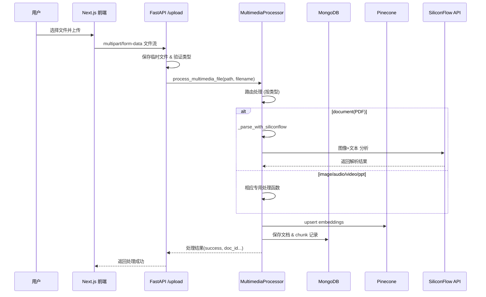

# AllpassAgent 多媒体文件上传与处理流程说明

本文档详细介绍了在 **AllpassAgent** 项目中，各类文件从前端上传到经 `multimedia_api` 接收并交给 `MultimediaProcessor` 处理的完整流程、内部关键模块以及每种文件类型的处理细节。

---
## 1. 整体架构

```
┌───────────────┐      HTTP(POST /upload)       ┌────────────────────┐
│  前端组件(Next)│ ───────────────────────────▶ │  multimedia_api (FastAPI) │
└───────────────┘                               │  • 保存临时文件        │
                                                │  • 文件类型识别       │
                                                │  • 调用 MultimediaProcessor
                                                └──────────┬─────────┘
                                                            │
                                                            │
                                             返回处理结果     │
                                                            ▼
                                          ┌────────────────────────┐
                                          │  MultimediaProcessor    │
                                          │  • 按类型分发处理        │
                                          │  • 生成嵌入向量          │
                                          │  • 写入 MongoDB & Pinecone│
                                          └──────────┬─────────────┘
                                                     │
                                                     │
                                            详情见各子模块
```

---
## 2. 前端上传流程 (Next.js)

1. 用户通过 **`<MultimediaUpload />`** 组件选择文件。
2. 组件将文件通过 `fetch('/api/upload')` (或直接向 FastAPI `/upload`) 发起 **`multipart/form-data`** POST 请求。
3. 前端在上传前会读取后端提供的 `/supported-types` 接口，展示允许的文件类型及说明。

---
## 3. 后端文件接收 (`multimedia_api.py`)

1. **路由定义**
   ```python
   @app.post("/upload", response_model=ProcessResponse)
   async def upload_multimedia_file(file: UploadFile = File(...)):
   ```
2. **文件类型校验**
   - 根据文件扩展名调用 `multimedia_processor.get_file_type()` 校验是否受支持。
3. **临时文件保存**
   - 使用 `tempfile.NamedTemporaryFile` 将上传内容写入磁盘，获得 `temp_file_path`。
4. **处理调用**
   ```python
   result = multimedia_processor.process_multimedia_file(temp_file_path, file.filename)
   ```
5. **响应封装**
   - 根据 `result` 返回 `ProcessResponse`（成功/失败、文档ID、内容块数量等）。
6. **清理**
   - 最终删除临时文件，避免磁盘累计。

---
## 4. 多媒体处理核心 (`MultimediaProcessor`)

### 4.1 初始化

- **SiliconFlow OpenAI 兼容客户端**：使用 `SILICONFLOW_API_KEY` + `base_url`。
- **MongoDB**：连接 `MONGODB_URI`，存储原始文档与分块内容。
- **Pinecone**：根据环境变量初始化向量索引，存储内容嵌入向量。
- **支持的文件类型**：维护 `ppt` / `image` / `video` / `audio` / `document` 五大类。

### 4.2 `process_multimedia_file()` 主入口

1. **文件类型识别**
2. **创建文档记录** -> `create_document_record()`
3. **按类型路由**
   | 类型 | 处理函数 | 关键步骤 |
   |------|----------|----------|
   | PPT  | `process_ppt` | `python-pptx` 解析文本 + 图片 → OCR → 合并文本 & 图片描述 |
   | Image| `process_image` | OCR (`pytesseract`) + SiliconFlow 视觉描述 |
   | Video| `process_video` | 提取音轨 + 语音转写(ASR) + 关键帧抽取 + 视觉描述 |
   | Audio| `process_audio` | 语音转写（`_recognize_with_siliconflow` 调用 TeleSpeechASR 模型） |
   | Document| `process_document_with_raganything` | 目前支持 PDF/Word/HTML 等；PDF 使用 **PyMuPDF** 分页提取文本+图片，图片经 `Qwen3-VL-8B-Instruct` 做视觉理解 |
4. **存储与向量化**
   - `store_multimedia_content()`
     1. 遍历 `content_data`，为每个块生成 `embedding` (OpenAI/SiliconFlow Embedding API)。
     2. 写入 Pinecone：向量 + metadata(doc_id, filename, file_type, page)。
     3. 写入 MongoDB：原始文本/元数据存储于 `multimedia_chunks` 集合。

### 4.3 搜索流程

`search_multimedia_content()`：
1. 将查询词通过同一 Embedding 模型向量化。
2. 调用 `_safe_pinecone_query()` 检索最相似向量，取前 `top_k` 条。
3. 根据 metadata 回查 MongoDB 获取全文、摘要。
4. 返回带 `score/filename/file_type/content` 的结果列表。

---
## 5. 详细处理示例 — PDF

1. `_parse_with_siliconflow()`
   - 使用 **PyMuPDF** 按页读取文本；
   - 将页面渲染成 2× 分辨率 PNG → base64；
   - 通过 SiliconFlow OpenAI 兼容 API 调用 `Qwen/Qwen3-VL-8B-Instruct`，让其分析图像中表格/公式/布局；
   - 合并文本与视觉分析结果生成统一内容块。
2. 返回内容结构示例
```json
{
  "type": "page",
  "page_number": 1,
  "text_content": "...该页提取的纯文本...",
  "image_analysis": "模型返回的文字描述/表格/公式等",
  "bbox": null,
  "source": "siliconflow"
}
```

---
## 6. 流程时序图 (伪代码级)



---
## 7. 关键环境变量

| 变量 | 说明 |
|------|------|
| `SILICONFLOW_API_KEY` | SiliconFlow OpenAI 兼容 API 密钥 (必需) |
| `SILICONFLOW_BASE_URL`| 可选，备用域名，如 `https://api.siliconflow.ai/v1` |
| `MONGODB_URI` | MongoDB 连接串，默认 `mongodb://localhost:27017/` |
| `PINECONE_API_KEY` | Pinecone 向量数据库 API Key |
| `PINECONE_INDEX_NAME` | Pinecone Index 名称 |
| `PINECONE_ENVIRONMENT`| （旧版SDK）环境名 |

---
## 8. 参考代码位置

- FastAPI 接口: <mcfile name="multimedia_api.py" path="/Users/apple/Dev/allpassagent/python/multimedia_api.py"></mcfile>
- 处理核心: <mcfile name="multimedia_processor.py" path="/Users/apple/Dev/allpassagent/python/multimedia_processor.py"></mcfile>
- React 上传组件: <mcfile name="MultimediaUpload.tsx" path="/Users/apple/Dev/allpassagent/src/components/MultimediaUpload.tsx"></mcfile>

---

> 本文档自动生成，用于说明 AllpassAgent 在文件上传与多媒体内容处理方面的整体流程与各环节细节。